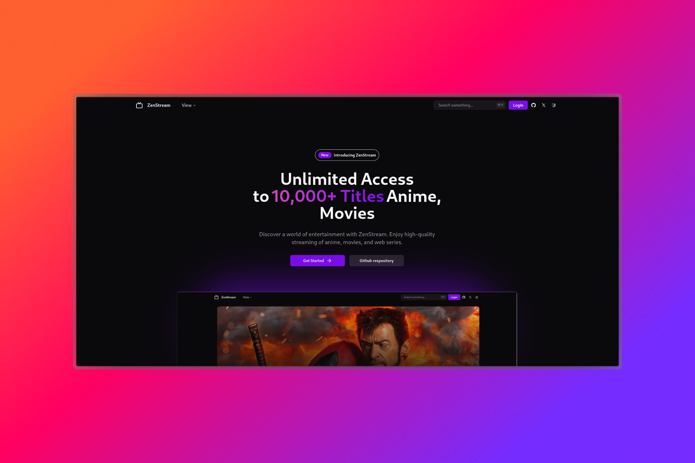

# ZenStream

ZenStream is a comprehensive OTT (Over-The-Top) platform that offers a diverse range of entertainment content, including movies, anime, K-dramas, and TV shows. This project aims to provide users with a seamless streaming experience, combining a user-friendly interface with a vast library of content across various genres.

## Key Features:
- Extensive library of movies, anime, K-dramas, and TV shows
- User-friendly interface for easy navigation and content discovery
- Personalized recommendations based on viewing history
- Multi-device support for a seamless viewing experience

Dive into the world of entertainment with ZenStream - Your go-to destination for all things streaming!


# Contributing

Thanks for your interest in contributing to Zenstream. We're happy to have you here.

If you need any help, feel free to reach out to [@Rx](https://twitter.com/shashivadan99).

## About this repository

This repository is a monorepo.

- We use [pnpm](https://pnpm.io) for development.

## Structure

This repository is structured as follows:

```
zenstream/
├── prisma
├── public
│   ├── icons
│   ├── landing-page
│   ├── link-images
│   └── readme
└── src
    ├── actions
    ├── app
    │   ├── api
    │   ├── (auth)
    │   ├── _components
    │   ├── get-started
    │   │   └── _components
    │   └── (stream)
    │       ├── anime
    │       │   ├── [id]
    │       │   └── watch
    │       │       └── [id]
    │       │           └── [episodeid]
    │       ├── drama
    │       │   ├── [id]
    │       │   └── watch
    │       │       └── [id]
    │       │           └── [eposideId]
    │       ├── movies
    │       │   ├── [id]
    │       │   └── watch
    │       │       └── [id]
    │       └── tv-shows
    │           ├── [id]
    │           └── watch
    │               └── [id]
    │                   └── [seasonId]
    │                       └── [episodeId]
    ├── components
    │   ├── landing-page
    │   ├── nav-bar
    │   ├── profile
    │   ├── stream-containers
    │   │   ├── anime-section
    │   │   ├── drama-section
    │   │   ├── movies-section
    │   │   ├── shared-media-component
    │   │   └── tv-shows-section
    │   └── ui
    ├── config
    ├── data-access
    ├── lib
    ├── server
    ├── styles
    └── types
```

## Development

### Fork this repo

You can fork this repo by clicking the fork button in the top right corner of this page.

### Clone on your local machine

```bash
git clone https://github.com/your-username/ui.git
```

### Navigate to project directory

```bash
cd zenstream
```

### Create a new Branch

```bash
git checkout -b my-new-branch
```

### Install dependencies

```bash
pnpm install
```

## Commit Convention

Before you create a Pull Request, please check whether your commits comply with
the commit conventions used in this repository.

When you create a commit we kindly ask you to follow the convention
`category(scope or module): message` in your commit message while using one of
the following categories:

- `feat / feature`: all changes that introduce completely new code or new
  features
- `fix`: changes that fix a bug (ideally you will additionally reference an
  issue if present)
- `refactor`: any code related change that is not a fix nor a feature
- `build`: all changes regarding the build of the software, changes to
  dependencies or the addition of new dependencies

  e.g. `feat(feature-name): what change you made`
